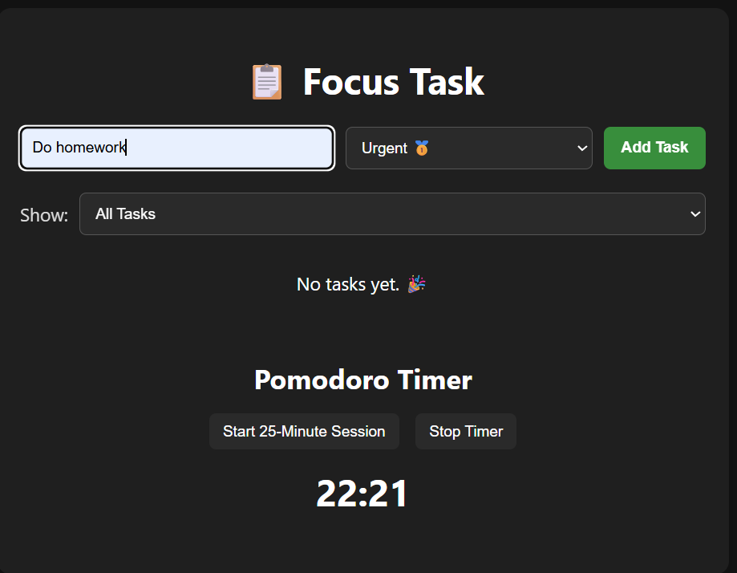
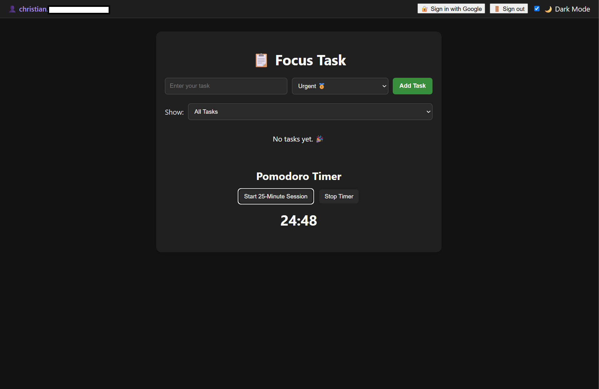
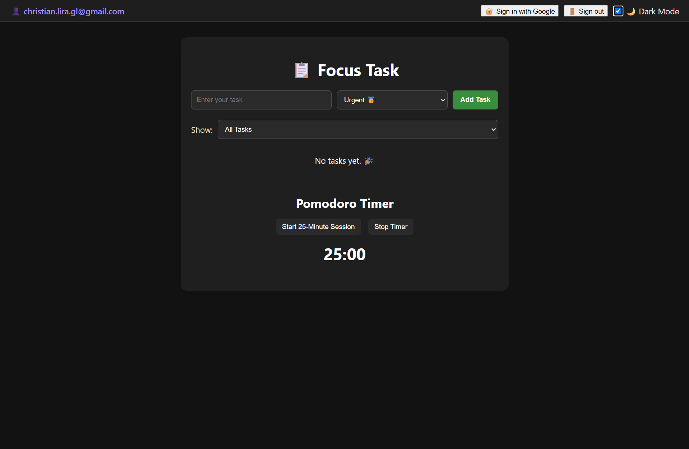
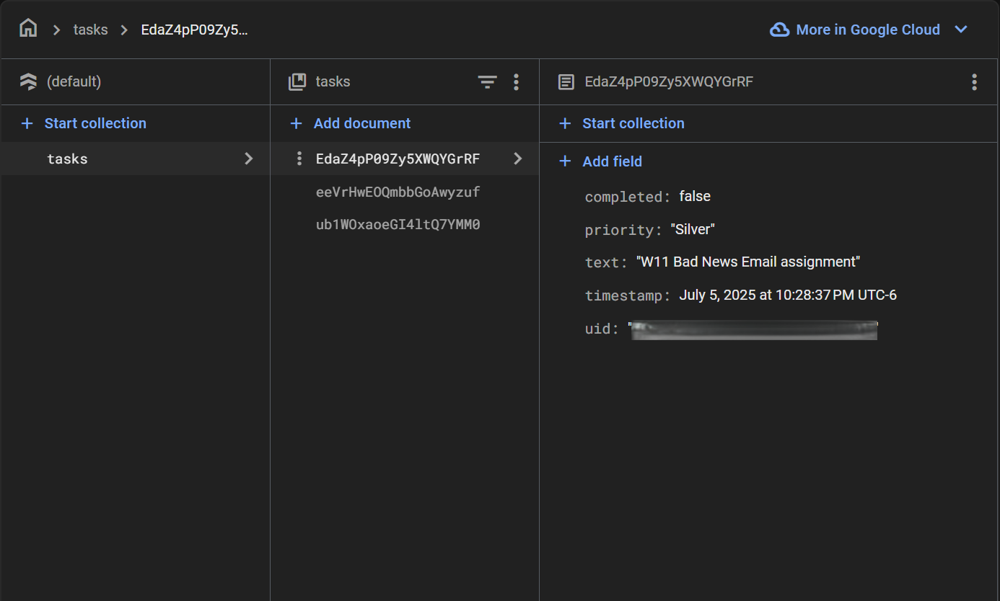

# Focus Task Web Application

**Focus Task** is a lightweight web-based task management tool designed to help users prioritize daily activities and maintain productivity using the Pomodoro technique. This updated version enhances the original local application by integrating Firebase services to enable cloud-based features and real-time synchronization.

## Key Features

- User authentication via Google Sign-In
- Real-time task creation, retrieval, and synchronization using Firebase Firestore
- Support for priority-based task organization (Urgent, Necessary, Important)
- Integrated Pomodoro timer to support focused work sessions
- Dark mode with user preference saved in local storage
- Firebase Hosting for online accessibility

This project demonstrates client-side development principles, cloud integration using Firebase, and responsive user interface design. It is suitable for individuals or teams looking to manage tasks with online support and a clean user experience.

This version builds on a previously developed local-only task manager by adding persistent cloud database functionality and enabling access across multiple devices.
Previous version can be found at: https://github.com/ChristianLG2/Applied_Programming/tree/main/Focus_Task 

## Demonstration

Below are screenshots demonstrating the functionality and interface of the application:

| Task Entry and Filtering | Pomodoro Timer in Action |
|--------------------------|--------------------------|
|  |  |

| Dark Mode Enabled | Cloud-Synced Tasks |
|-------------------|--------------------|
|  |  |

> Note: All tasks shown are stored and synced with Firebase Cloud Firestore under each user's authenticated account.

## Why This App and These Features?

This application was built to encourage focused productivity by combining task prioritization with the Pomodoro technique. Many existing tools offer either timer functionality or task lists but not both in a simple, distraction-free environment. 

The app was designed with the following goals in mind:
- Encourage task discipline through visual priority tagging
- Support consistent work cycles via Pomodoro sessions
- Allow users to access and manage their tasks from any device
- Provide a clean and responsive interface with light/dark mode toggling

## Features

- **Google Authentication:** Secure sign-in and sign-out flow using Firebase Authentication.
- **Cloud Task Storage:** Tasks are stored in Firebase Firestore, enabling real-time syncing across sessions and devices.
- **Priority-Based Task Filtering:** Tasks are categorized as Urgent, Necessary, or Important to help users triage workload effectively.
- **Pomodoro Timer:** Built-in 25-minute timer with an alert sound for structured productivity intervals.
- **Dark Mode:** Toggle between light and dark themes, with preferences saved in the browser.
- **Responsive UI:** Optimized layout and controls for both desktop and mobile use.


## Tools Used

- **Firebase Firestore:** Cloud-hosted NoSQL database for task persistence.
- **Firebase Authentication:** For secure and scalable user login functionality.
- **Firebase Hosting:** Deploy and serve the app on the web.
- **HTML/CSS/JavaScript:** Core front-end technologies used to build the interface and logic.
- **Toastify.js:** Simple notification alerts to inform users of actions like task addition or errors.
- **Moment.js:** For time formatting and timestamp management.

## Project Structure

```plaintext
.
├── index.html          # Main webpage with task input and Pomodoro timer
├── style.css           # Styling for layout, priority colors, and responsiveness
├── script.js           # JavaScript logic for task management and timer
├── assets/
│   └── beep.mp3        # (Optional) Pomodoro alert sound
└── README.md           # Project documentation

